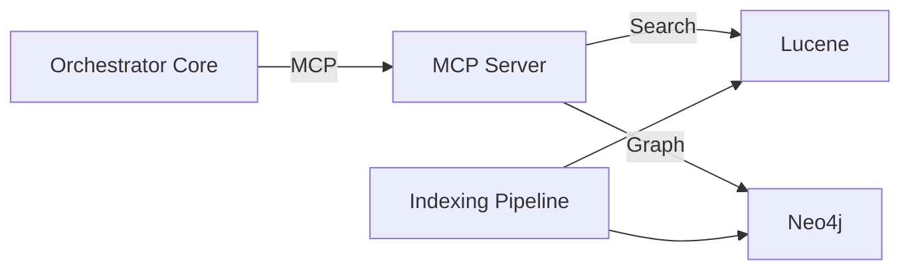

# UB-19 Backend

This project contains the multi-module build for the MCP Code Understanding & API Modernization Platform.

## Architecture


## Documentation
- [Quickstart](docs/quickstart.md)
- [API Reference](docs/api.md)

## Build
```bash
mvn -q -Pci -DskipTests package
```

## Run
### Orchestrator Core
```bash
java -jar orchestrator-core/target/orchestrator-core-1.0.0-SNAPSHOT.jar
```
Health endpoint: `http://localhost:8080/actuator/health`

### MCP Server
```bash
java -jar mcp-server/target/mcp-server-1.0.0-SNAPSHOT.jar
```
Health endpoint: `http://localhost:8081/actuator/health`

### Indexer CLI
```bash
java -jar indexer/target/indexer-1.0.0-SNAPSHOT.jar --repo=/path/to/repo --index=/data/mcp/index
```
Logs total documents, methods, and sections indexed.
